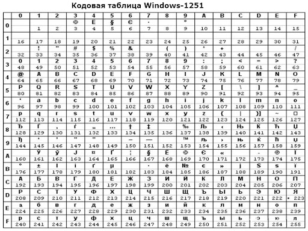
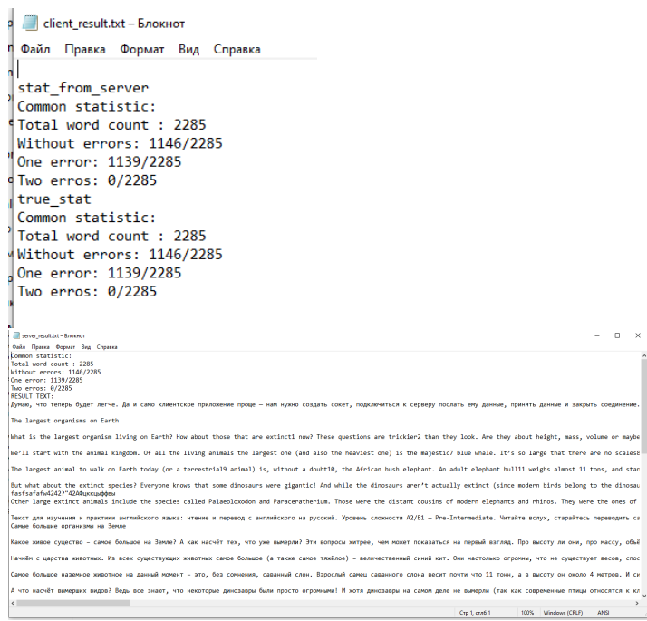
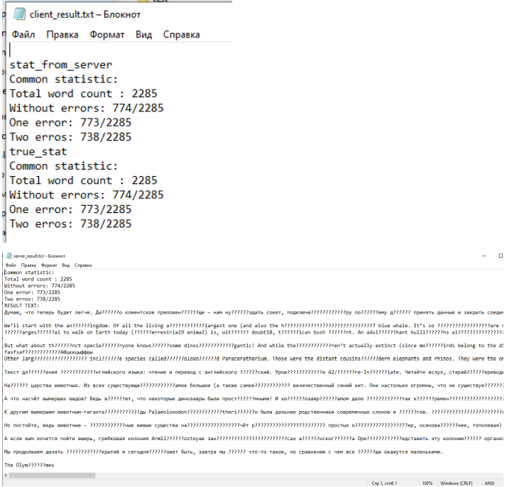

### ЛР 1. Сокеты и код Хемминга 

### Задание: 

1.  С помощью сокетов реализовать передачу сообщений по локальной сети. Для определения хоста назначения необходимо использовать IP-адрес и порт (к примеру, 192.168.123.234:45102).
2.  Закодировать передаваемое сообщение кодом Хемминга с определенной длиной слова. (по вариантам)
3.  Иметь возможность добавлять в сообщение не более n ошибок на каждое слово (этот функционал должен быть реализован на стороне передачи сообщения).
4.  Раскодировать сообщение, исправить одиночные ошибки и определить наличие множественных ошибок (>1) в словах.
5.  Обратно передать сообщение с информацией о количестве исправленных ошибок, количество правильно и неправильно доставленных слов.
6.  Сравнить эту информацию с внесенными ошибками из п.3 (количество слов без ошибок, с 1 ошибкой, с 2 и более ошибок) на стороне отправителя сообщения.
7.  Отдельно отследить слова (привести статистику), в которых парные ошибки не влияют на биты четности (кодирование Хемминга не позволяет определить ошибки в слове).


### Информация

Кодирование происходит по принципу ```cp1251``` 

Сервер и клиент генерирует файлы со статистикой



### Результаты

Тесты для двух ошибок и различных ошибок (1 и 2)


