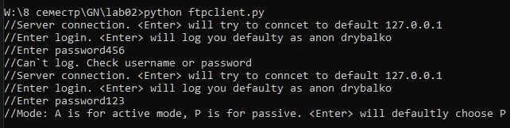
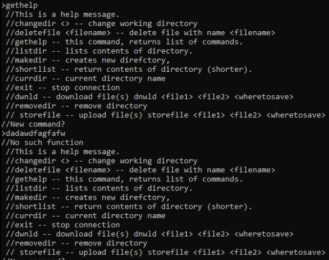
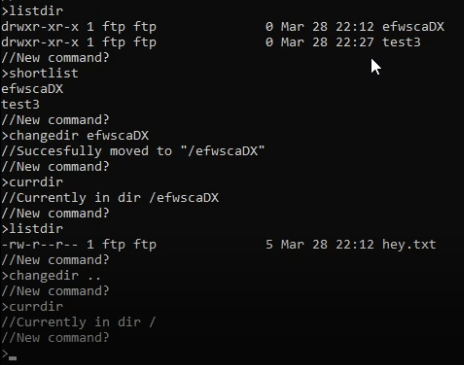
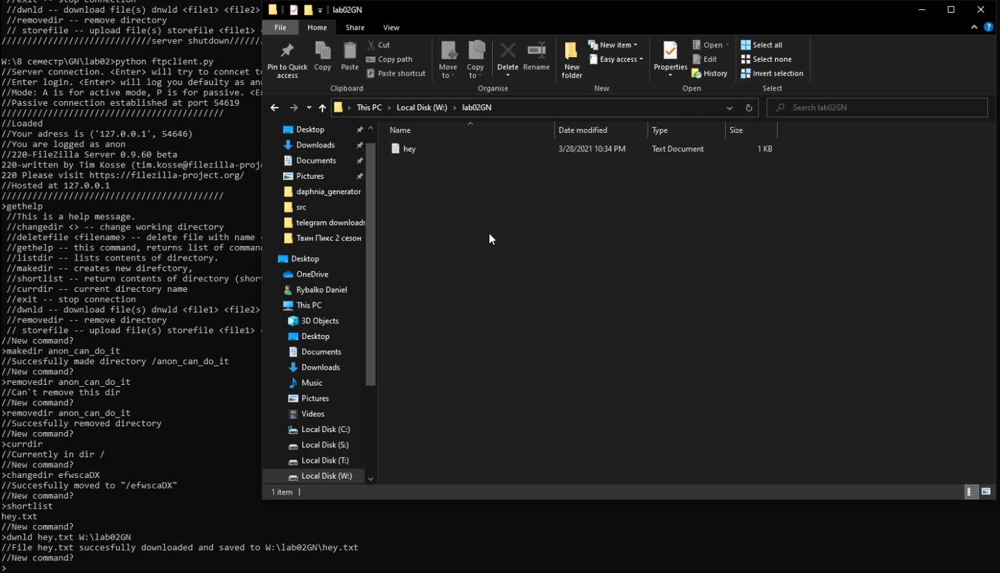
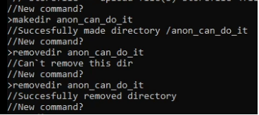
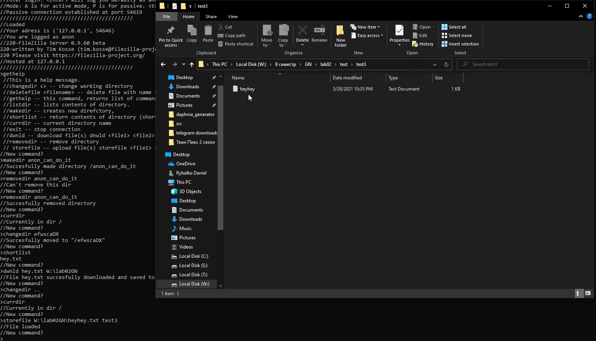

# Лабораторная работа 2

## FTP-клиент
FTP-клиент был реализован благодаря библиотеке python ftplib

### 1. Аутентификация на сервере
Функция ```auth``` выполняет идентификацию. 


### 2. Функция справки
Команда ```gethelp``` выдаёт справочную информацию, так же она вызывается когда введена неправильная команда.


### 3. Выбор директории и скачивание файлов
Реализованы благодаря командам сервера ```changedir %dir%```, ```changedir ..``` возвращает в предудщую директорию. Скачивание файлов -- команда ```dwnld %file1% %file2% %wheretosave%```. Команда ```listdir``` выводит все элементы дирректории, команда ```shortlist``` выводит их в укороченном виде.




### 4. Выбор директории/создание дирректории и загрузка файлов 
Создание директории выполняется командой ```makedir %dir%```, удаление директории командой ```removedir %dir%```. Загрузка файла на сервер выполняется командой ```storefile %file1% %wheretostore%```




