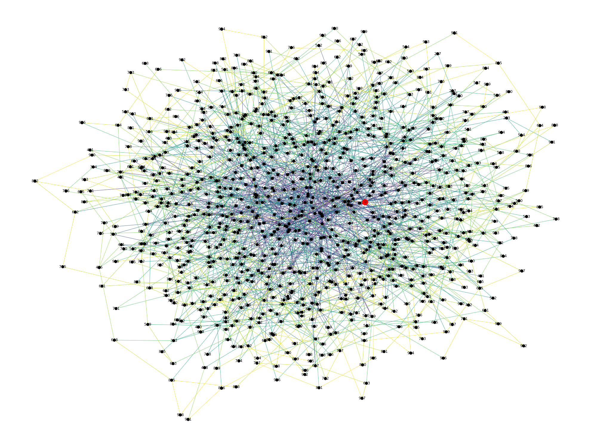
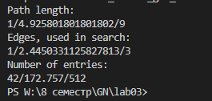

# Лабораторная работа 3

##	ЗАДАНИЕ
1. Реализовать алгоритм поиска в децентрализованной пиринговой сети (Tapestry)
2. Разработать функцию генерации связанного неориентированного графа (представление пиринговой сети) с заданными параметрами:
    - 	количество вершин (~1000);
    -	степени вершины (мин./средняя/макс.) (мин. степень вершины >2; макс. степень вершины <10);
    -   распределение значений степени вершины на выбор студента: равномерное, нормальное, экспоненциальное и т.д.)
3. Для каждой вершины графа определить дополнительные свойства (в соответствии с реализуемыми алгоритмом поиска) и наличие определенной информации.
4. Произвести поиск информации на графе пиринговой сети для каждого пира сети (вершины графа).
5. Реализовать визуализацию поиска для вершин, удаленных от источника информации на 5, 10, 15 хопов.
6. Систематизировать и проанализировать результаты поиска. Определить эффективность реализации алгоритма распределенного поиска. Среди результатов обязательно должны быть:
    -   Длина пути (Мин./Ср./Макс.);
    -   Задействованные ресурсы сети или количество дуг, задействованные в поиске (Мин./Ср./Макс.);
    -	Объем хранимой информации на узлах (Мин./Ср./Макс.).

## АЛГОРИТМ TAPESTRY
Алгоритм Tapestry вводит понятие оверлейной сети, по которой соединяет узлы, образующую пиринговую сеть. Каждый узел сети имеет случайно сгенерированный 40-значный идентификатор в шестнадцатеричной системе счисления (по алгоритму хеширования SHA-1). Такого же типа идентификатор присваивается и файлам, которые публикуются в пиринговой сети. 

Информация о файлах хранится на узлах следующим образом. При публикации нового файла на одном из узлов сети у него появляется идентификатор. По этому идентификатору находится узел, умеющий идентификатор с наибольшим совпадением, и далее на этот узел пересылается информация о местоположение файла. Все узлы, которые передавали информацию о местоположении файла, также ее себе запишут.

Передача информации о файлах и самих файлах проводится по таблицам маршрутизации оверлейной сети. Такая таблица маршрутизации является многоуровневой. Уровни находятся в значениях L = 1…39, где каждый следующий уровень содержит узлы, совпадающий с исходным по началу префикса на величину L - 1. 

Поиск файла происходит по таблицам маршрутизации через поиск наибольшего совпадения записи и идентификатора файла по префиксу до тех пор, пока не найдется узел, знающий точное местоположение запрашиваемого файла.

## РЕЗУЛЬТАТЫ

|               | Мин | Сред   | Макс |
|---------------|-----|--------|------|
| ДЛИННА        | 1   | 4.92   | 9    |
| ДУГИ В ПОИСКЕ | 1   | 2.44   | 3    |
| ОБЪЕМ ИНФ.    | 42  | 172.63 | 512  |

## СКРИНШОТЫ
Зелёная -- точка файла
Красная -- текущая точка запроса

Первая итерация поиска

Вторая итерация поиска

Третья итерация поиска

Вывод программы